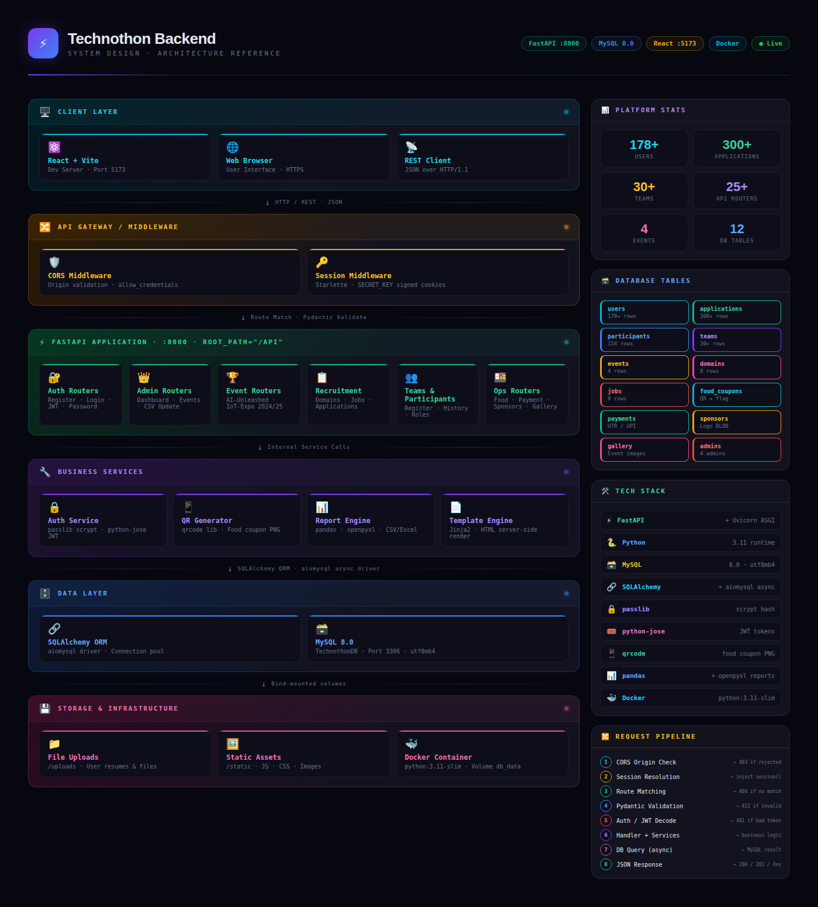
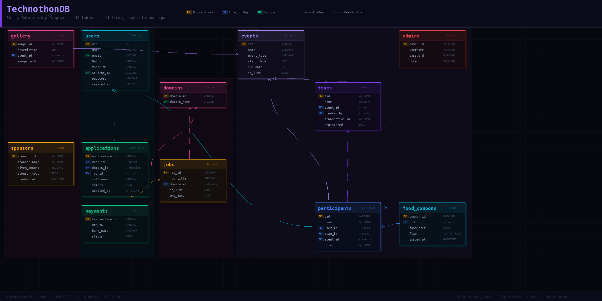

<div align="center">


<br/>

<a href="https://fastapi.tiangolo.com"></a>
<a href="https://www.python.org"></a>
<a href="https://www.mysql.com"></a>
<a href="https://www.docker.com"></a>
<a href="#"></a>

<br/><br/>


</div>

---

## 📋 Table of Contents

- [Overview](#-overview)
- [System Design](#-system-design)
  - [Layered Architecture](#1️⃣-layered-architecture)
  - [Request Middleware Pipeline](#2️⃣-request-middleware-pipeline)
  - [Database ER Diagram](#3️⃣-database-er-diagram)
  - [Key Request Flows](#4️⃣-key-request-flows)
  - [Docker Infrastructure](#5️⃣-docker-infrastructure)
- [Tech Stack](#-tech-stack)
- [API Modules](#-api-modules)
- [Database Schema](#-database-schema)
- [Quick Start](#-quick-start)
- [Environment Variables](#-environment-variables)
- [Docker Setup](#-docker-setup)
- [API Documentation](#-api-documentation)
- [Team](#-team)

---

## 🌟 Overview

The **Technothon Backend** is the server-side engine for the Technothon event management platform at Techno India University. It handles everything from user registration and team formation to food coupon QR generation and sponsor management — all wrapped in a high-performance FastAPI application.

<div align="center">

| Metric | Value |
|--------|-------|
| 👥 Registered Users | **178+** |
| 📝 Applications | **300+** |
| 🏆 Teams | **30+** |
| 🎯 Domains | **8** |
| 📡 API Endpoints | **25+ Routers** |
| 🗃️ DB Tables | **12** |

</div>

---

## 🧠 System Design

### 1️⃣ Layered Architecture

The backend is structured into **6 distinct layers**. Each layer has a single responsibility and only communicates with adjacent layers — keeping the system clean, testable, and easy to extend.

<div align="center">



</div>

---

### 2️⃣ Request Middleware Pipeline

Every incoming HTTP request passes through this **ordered pipeline** before reaching a handler function:

```
  Incoming HTTP Request
         │
         ▼
  ┌──────────────────────────────────────────────┐
  │            CORS Middleware                    │
  │  Reads Origin header                          │
  │  Allowed? → continue   Not allowed? → 403     │
  └──────────────────────────┬───────────────────┘
                             │
                             ▼
  ┌──────────────────────────────────────────────┐
  │           Session Middleware                  │
  │  Decodes signed session cookie                │
  │  Injects request.session dict into context    │
  └──────────────────────────┬───────────────────┘
                             │
                             ▼
  ┌──────────────────────────────────────────────┐
  │             Route Matcher                     │
  │  Matches (method + path) → router function    │
  │  No match? → 404 Not Found                    │
  └──────────────────────────┬───────────────────┘
                             │
                             ▼
  ┌──────────────────────────────────────────────┐
  │          Pydantic Validation                  │
  │  Validates request body against schema model  │
  │  Fails? → 422 Unprocessable Entity            │
  └──────────────────────────┬───────────────────┘
                             │
                             ▼
  ┌──────────────────────────────────────────────┐
  │          Auth / Dependency Injection          │
  │  Decodes JWT via python-jose                  │
  │  Checks session["admin"] for admin routes     │
  │  Fails? → 401 Unauthorized                    │
  └──────────────────────────┬───────────────────┘
                             │
                             ▼
  ┌──────────────────────────────────────────────┐
  │            Handler Function                   │
  │  Business logic + service calls               │
  │  (QR gen, report export, email templates …)   │
  └──────────────────────────┬───────────────────┘
                             │
                             ▼
  ┌──────────────────────────────────────────────┐
  │              Database Query                   │
  │  SQLAlchemy ORM → aiomysql → MySQL 8          │
  │  Async with connection pooling                │
  └──────────────────────────┬───────────────────┘
                             │
                             ▼
  ┌──────────────────────────────────────────────┐
  │              JSON Response                    │
  │  Pydantic serializes response model           │
  │  Returns HTTP 200 / 201 / 400 / 404 / 500     │
  └──────────────────────────────────────────────┘
```

---

### 3️⃣ Database ER Diagram

<div align="center">



</div>

<details>
<summary><b>View ER diagram as ASCII</b></summary>

```
 ┌──────────────────────┐          ┌──────────────────┐
 │        users         │          │     domains       │
 │──────────────────────│          │──────────────────│
 │ uid (PK)             │          │ domain_id (PK)    │◀─────────────┐
 │ Name                 │          │ domain_name       │              │
 │ email     UNIQUE     │          └──────────────────┘              │
 │ Batch                │                    ▲                        │
 │ Phone_No             │                    │                        │
 │ Student_ID UNIQUE    │          ┌──────────────────┐              │
 │ password  (scrypt)   │          │       jobs        │              │
 │ created_at           │          │──────────────────│              │
 └──────────┬───────────┘          │ job_id (PK)      │              │
            │ 1                    │ domain_id (FK) ──┘              │
            │ N                    │ is_live / end_date              │
            ▼                      └──────────────────┘              │
 ┌────────────────────────────────────────────────────────────┐      │
 │                       applications                          │      │
 │ application_id (PK)  user_id (FK)  domain_id (FK) ─────────┘      │
 │ job_id (FK)  full_name  skills  applied_at                         │
 └────────────────────────────────────────────────────────────┘

 ┌──────────────┐  1   N  ┌──────────────────┐  N   1  ┌──────────────┐
 │    events    │◀────────│   participants    │─────────▶│    teams     │
 │ eid (PK)     │         │ pid (PK)         │          │ tid (PK)     │
 │ name         │         │ user_id (FK)     │          │ event_id(FK) │
 │ event_type   │         │ team_id (FK)     │          │ created_by   │
 │ is_live      │         │ event_id (FK)    │          │  (FK→pid)    │
 └──────┬───────┘         │ role             │          └──────────────┘
        │ 1               └────────┬─────────┘
        │ N                        │ 1  N
        └────────────────▶ ┌───────▼──────────────┐
                           │     food_coupons       │
                           │ coupon_id (PK)         │
                           │ pid (FK → parts)       │
                           │ food_preference / flag  │
                           └────────────────────────┘

 standalone: admins · payments · sponsors · gallery(FK→events)
```

</details>

---

### 4️⃣ Key Request Flows

<details>
<summary><b>🔐 User Registration Flow</b></summary>

```
  Browser → POST /api/register { name, email, Student_ID, password }
    │
    ├─ CORS check ──── rejected? → 403
    ├─ Pydantic validates ──── invalid? → 422
    ├─ SELECT users WHERE email=? OR Student_ID=? ──── exists? → 400
    ├─ passlib.hash.scrypt.hash(password)
    ├─ Generate uid
    ├─ INSERT INTO users
    └─ 201 Created { uid, name, email }
```

</details>

<details>
<summary><b>📋 Application Submission Flow</b></summary>

```
  POST /api/applications  Header: Authorization: Bearer <JWT>
    │
    ├─ JWT decode ──── invalid? → 401
    ├─ SELECT domains WHERE domain_id=? ──── not found? → 404
    ├─ SELECT jobs WHERE job_id=? AND domain_id=? ──── mismatch? → 400
    ├─ INSERT INTO applications
    └─ 201 Created { application_id, domain, status: "submitted" }
```

</details>

<details>
<summary><b>🍱 Food Coupon & QR Flow</b></summary>

```
  POST /api/food-coupon { pid, food_preference }  (Admin only)
    │
    ├─ session["admin"] check ──── missing? → 403
    ├─ SELECT participants WHERE pid=? ──── not found? → 404
    ├─ SELECT food_coupons WHERE pid=? ──── exists? → 409
    ├─ INSERT INTO food_coupons (flag=0)
    ├─ qrcode.make(coupon_id) → PNG
    └─ 201 Created { coupon_id, qr_image_base64 }

  GET /api/food-coupon/redeem/{coupon_id}
    ├─ flag == 1? → 409 Already redeemed
    ├─ UPDATE food_coupons SET flag=1
    └─ 200 OK { redeemed: true }
```

</details>

<details>
<summary><b>🏆 Team Registration Flow</b></summary>

```
  POST /api/team-register { name, idea_title, event_id, members[], transaction_id }
    │
    ├─ JWT decode → creator user_id
    ├─ SELECT events WHERE eid=? AND is_live=1 ──── not live? → 400
    ├─ For each member: SELECT users WHERE uid=? ──── missing? → 404
    ├─ INSERT INTO teams (registered=0)
    ├─ For each member: INSERT INTO participants
    ├─ UPDATE teams SET registered=1
    └─ 201 Created { tid, members: [pid…] }
```

</details>

---

### 5️⃣ Docker Infrastructure

```
┌─────────────────────────────────────────────────────────────────────┐
│                       docker-compose.yml                            │
│                                                                     │
│  ┌──────────────────────────┐   ┌──────────────────────────┐       │
│  │         backend           │   │         frontend          │       │
│  │ FROM python:3.11-slim     │   │ FROM node:18-alpine       │       │
│  │ pip install -r req.txt    │   │ npm install --legacy-deps │       │
│  │ python3 db.py  ← init DB  │   │ CMD npm run dev           │       │
│  │ CMD uvicorn :8000         │   │ Port: 5173 → 5173         │       │
│  │ Port: 8000 → 8000         │   │ Hot reload: ✅            │       │
│  │ depends_on: db            │   └──────────────────────────┘       │
│  └─────────────┬────────────┘                                       │
│                │ depends_on                                          │
│  ┌─────────────▼──────────────────────────────────────────────┐    │
│  │  db  image: mysql:8  Port: 3307→3306  Volume: db_data       │    │
│  │  MYSQL_DATABASE=TechnothonDB  Charset: utf8mb4              │    │
│  └─────────────────────────────────────────────────────────────┘    │
│  Network: bridge   Volumes: db_data (persistent)                    │
└─────────────────────────────────────────────────────────────────────┘

  docker compose up --build
  docker compose logs -f backend
  docker compose exec db mysql -u root -p TechnothonDB
```

---

## 🛠️ Tech Stack

<div align="center">

| Layer | Technology | Purpose |
|-------|-----------|---------|
| **Framework** | FastAPI + Uvicorn | Async REST API, auto-docs |
| **Language** | Python 3.11 | Core runtime |
| **Database** | MySQL 8.0 | Persistent storage |
| **ORM** | SQLAlchemy + aiomysql | Async DB operations |
| **Auth** | python-jose + passlib | JWT tokens + password hashing |
| **Sessions** | Starlette SessionMiddleware | Cookie-based sessions |
| **Reports** | pandas + openpyxl | Excel export & CSV updates |
| **QR Codes** | qrcode | Food coupon generation |
| **Templates** | Jinja2 | HTML email / server-side render |
| **Container** | Docker (python:3.11-slim) | Isolated deployment |

</div>

---

## 📡 API Modules

<details>
<summary><b>🔐 Authentication & Users</b></summary>

| Router | Tag | Description |
|--------|-----|-------------|
| `Users_register` | Register | User signup with validation |
| `Users_login` | Login | Login with session + JWT |
| `Users_dashboard` | Dashboard | Profile & stats view |
| `password_update` | Password Update | Secure password change |

</details>

<details>
<summary><b>🛡️ Admin Panel</b></summary>

| Router | Tag | Description |
|--------|-----|-------------|
| `alogin` | Login / Logout | Admin auth under `/admin` prefix |
| `admin_dashboard` | Dashboard | Admin metrics, stats, management |
| `admin_event` | Admin Events | Create & manage events |
| `Update_csv` | Update CSV | Attendance CSV import/export |

</details>

<details>
<summary><b>🏆 Events & Teams</b></summary>

| Router | Tag | Description |
|--------|-----|-------------|
| `team_register` | Team Registration | Create and join teams |
| `user_event` | User Event | Event discovery for users |
| `AU_2024 / AU_2025` | AI-Unleashed Data | AI event data 2024 & 2025 |
| `IE_2024 / IE_2025` | IoT-Exposition Data | IoT event data 2024 & 2025 |
| `eventdata` | Event Data | Generic event data retrieval |
| `participant_data` | Past Teams | Historical participant data |

</details>

<details>
<summary><b>📋 Recruitment & Applications</b></summary>

| Router | Tag | Description |
|--------|-----|-------------|
| `applications` | Applications | Submit & manage applications |
| `domains` | Domains | 8 recruitment domains |
| `jobs` | Jobs | Job listings per domain |

</details>

<details>
<summary><b>🍱 Food, Payments & More</b></summary>

| Router | Tag | Description |
|--------|-----|-------------|
| `food_coupon` | Food Coupons | QR-based coupon generation & scanning |
| `payment_route` | Payment | UTR/UPI payment tracking |
| `sponsors` | Sponsors | Sponsor management & logos |
| `gallery` | Gallery | Event image gallery |

</details>

---

## 🗄️ Database Schema

<details>
<summary><b>Click to expand full column-level schema</b></summary>

```
TechnothonDB
│
├── users
│   ├── uid (PK)                    varchar(255)
│   ├── Name                        varchar(100)
│   ├── email         UNIQUE        varchar(100)
│   ├── Batch                       varchar(100)
│   ├── Phone_No / Whatsapp_No      varchar(20)
│   ├── Overall_Percentage          int
│   ├── Student_ID    UNIQUE        varchar(100)
│   ├── password                    varchar(255)  ← scrypt hash
│   └── created_at                  datetime
│
├── admins
│   ├── admin_id (PK)               varchar(10)
│   ├── username, password          varchar(100)
│   └── role                        varchar(50)
│
├── domains
│   ├── domain_id (PK)              varchar(255)
│   └── domain_name UNIQUE          varchar(255)
│       [Backend · Frontend · Management · Marketing ·
│        Designing · Decoration · Videography · Anchoring]
│
├── jobs
│   ├── job_id (PK)                 varchar(255)
│   ├── job_title, job_description
│   ├── domain_id (FK → domains)    varchar(255)
│   ├── is_live                     tinyint(1)
│   └── end_date                    date
│
├── applications
│   ├── application_id (PK)         varchar(255)
│   ├── user_id   (FK → users)      CASCADE DELETE
│   ├── domain_id (FK → domains)    RESTRICT
│   ├── job_id    (FK → jobs)       SET NULL
│   ├── full_name, academic_batch, student_id, phone_number
│   ├── email_address, resume_link, github_link
│   ├── skills, experience, reason
│   └── applied_at                  datetime
│
├── events
│   ├── eid (PK)                    varchar(100)
│   ├── name, description, event_type
│   ├── start_date, end_date        date
│   ├── prize_details               text
│   └── is_live                     tinyint
│
├── teams
│   ├── tid (PK)                    varchar(100)
│   ├── name, idea_title, idea_description
│   ├── event_id    (FK → events)
│   ├── created_by  (FK → participants.pid)
│   ├── transaction_id
│   ├── registered                  tinyint(1)
│   └── created_at                  timestamp
│
├── participants
│   ├── pid (PK)                    varchar(10)
│   ├── name, email
│   ├── user_id   (FK → users)
│   ├── team_id   (FK → teams)
│   ├── event_id  (FK → events)
│   └── role                        varchar(50)
│
├── food_coupons
│   ├── coupon_id (PK)              varchar(255)
│   ├── pid       (FK → participants)
│   ├── food_preference             varchar(255)  default 'Veg'
│   ├── flag                        int  default 0
│   └── issued_at                   datetime
│
├── payments
│   ├── transaction_id (PK)         varchar(255)
│   ├── utr_no, bank_name, upi_id
│   ├── paid_at                     datetime
│   └── status                      varchar(20)  default 'PENDING'
│
├── sponsors
│   ├── sponsor_id (PK)             varchar(255)
│   ├── sponsor_name, selling_domain
│   ├── given_amount                bigint
│   ├── sponsor_logo                longblob
│   └── created_at / updated_at    datetime
│
└── gallery
    ├── image_id (PK)               varchar(255)
    ├── event_id (FK → events)      varchar(100)
    ├── image_path                  varchar(500)
    └── created_at                  datetime
```

</details>

---

## 🚀 Quick Start

### Prerequisites

- Python 3.11+
- MySQL 8.0+
- Docker & Docker Compose (recommended)

### Local Development

```bash
git clone https://github.com/your-org/technothon-backend.git
cd technothon-backend

python -m venv venv
source venv/bin/activate  # Windows: venv\Scripts\activate

pip install -r req.txt
python db.py

uvicorn app.main:app --host 0.0.0.0 --port 8000 --reload
```

API live at **http://localhost:8000** · Docs at **http://localhost:8000/api/docs**

---

## ⚙️ Environment Variables

```env
DB_HOST=localhost
DB_PORT=3306
DB_USER=root
DB_PASSWORD=your_password
DB_NAME=TechnothonDB
SESSION_SECRET_KEY=your-super-secret-key-here
DEBUG=False
```

---

## 🐳 Docker Setup

```bash
docker compose up --build
```

```yaml
services:
  backend:
    build: ./backend
    ports: ["8000:8000"]
    depends_on: [db]
    env_file: .env
  frontend:
    build: ./frontend
    ports: ["5173:5173"]
  db:
    image: mysql:8
    ports: ["3307:3306"]
    volumes: [db_data:/var/lib/mysql]
    environment:
      MYSQL_ROOT_PASSWORD: ${DB_PASSWORD}
      MYSQL_DATABASE: TechnothonDB
volumes:
  db_data:
```

---

## 📖 API Documentation

| Endpoint | Description |
|----------|-------------|
| `GET /api/` | Health check |
| `GET /api/docs` | Swagger UI |
| `GET /api/redoc` | ReDoc |
| `GET /api/openapi.json` | OpenAPI Schema |

---

## 👥 Team

<div align="center">

| Admin ID | Name | Role |
|----------|------|------|
| ADM001 | Rahul Mahato | Administrator |
| ADM002 | Pranav Raj Wardhan | Technothon Head |
| ADM003 | Avinandan Bhattacharjee | Backend Lead |
| ADM004 | Ranit Saha | Co-Lead |

</div>

---

## 🎯 Events Supported

<div align="center">

| Event ID | Event Name | Type | Year |
|----------|-----------|------|------|
| TT01 | AI-Unleashed | Software / AI | 2025 |
| TT02 | AI-Unleashed | Software / AI | 2024 |
| TT03 | IoT-Exposition | Hardware / IoT | 2024 |
| TT04 | IoT-Exposition | Hardware / IoT | 2025 |

</div>

---

<div align="center">


**Built with ❤️ by the Technothon Backend Team**

*FastAPI · MySQL · Docker · Python 3.11*

</div>
